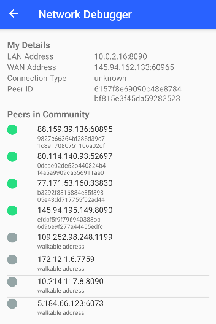
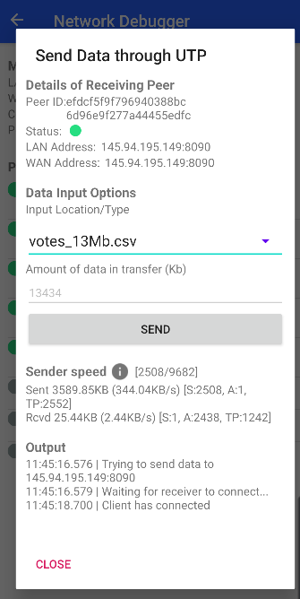
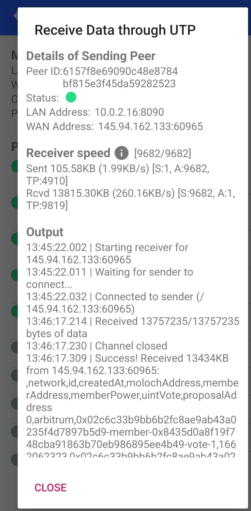

# Network Debugger

## Walkthrough of Network Debugger

Our implementation has the following functionalities:

### Network Debugger

Users can easily monitor peer activity. Peers in the walkable list (i.e. peers we have received packets from or have heard about from other peers) are listed and have corresponding colours according to their activity. We have the following colour scheme:

- Green - we have received IPv8 packets from the peer within 10 seconds.
- Yellow - we have received IPv8 packets from the peer within 20 seconds.
- Red - we haven’t received IPv8 packets from the peer in the last minute.
- Grey - we have heard about the peer, but have not received a packet from them yet.

It is important to note that peers are automatically removed from the list when they become inactive and are no longer part of the walkable list. Moreover, a user is prevented from sending data to grey peers as we have no direct communication with them implying a lack of puncture.

### Sending data

Upon clicking on a peer row the user is presented a panel, where using a drop-down menu, the user can select a file they would like to transfer or simply send a selected amount of predetermined data. In this panel, users can also track important information about the data transfer process like speed and progress.

### Receiving data

For a user who has opened the Network Debugger, if a sender starts sending data to them, then a popup panel shows, which similarly to the sender panel indicates progress and other useful details about the data transfer.

## Information about UTP

To achieve seamless transfers of larger information between peers we have utilized the Micro Transport Protocol (UTP). It implements the ledbat algorithm that aims to provide a congestion control mechanism on top of UDP. However, UTP does not provide NAT puncturing which is necessary for our P2P communication. Thus, our team made sure to integrate UTP into the IPv8 protocol which the Trustchain superapp had already utilized.

The main idea of the integration procedure was to alter the socket that UTP uses. By design, the protocol relies on Datagram sockets, which are Java’s built-in sockets that handle UDP packet transfers. To be able to use the same Datagram socket as IPv8, which is successfully punctured, we would have to package UTP messages in IPv8 and not UDP, otherwise, a different socket has to be bound, preventing us from a coherent integration with the already existing network abstraction in the superapp. To tackle this, we created an extended Datagram socket, which overwrites some functionalities so that they utilize the IPv8 protocol. This “socket” is added as a listener to a community, which allows it to also listen for messages and handle messages with the appropriate IPv8 header ID (currently set to 254).

Let’s go through an example usage of UTP in the context of our application. The sender initiates the communication by sending an IPv8 package containing the total size of their file. Sending a byte array using UTP is done by creating a _UtpServerSocketChannel_ to which we provide our custom socket and we wait for the receiver to connect. After receiving the IPv8 package, containing the size of the file, the receiver establishes a _UtpSocketChannel_ and connects to the sender’s “server”. After the connection is established, the sender starts sending the file data (split into packets) to the receiver and tracks which packets need to be re-send using acknowledgement packets which the receiver sends back. After all packets have been received both parties close their UTP channels.

## Design Choices

All peers in the community are displayed in the list. We chose to continuously preview and update in real-time the status of the peers in the community discovered by the IPv8 gossip discovery protocol.

WAN address and Peer ID are used to distinguish users and more information as LAN address and your connection type are also available for preview.

We use our own fork (https://github.com/KolevVelyan/trustchain-superapp ) of the utp4j repository (https://github.com/Tribler/utp4j ) as we needed to make our own changes on the UTP library:

- Sequence number changed from random to deterministic
- We send the correct size of the data to be sent through the IPv8 protocol and change the buffer size accordingly
- Socket binding was made overridable
- Socket was made public
- Window size changed for optimal speed

We denote two roles: sender and receiver. The sender is the peer that sends the data and the receiver is the user that receives the data. In the UTP protocol, this translates into the sender waiting for the receiver to initiate a connection acting thus as a server, whereas the receiver is the one that initiates the UTP transfer acting as a client.

We can handle one receiving transaction at a time to be able to see the details and debug the transaction.

We assume the receiver can depend on the data size sent through IPv8 to change the buffer size accordingly and receive the data correctly.

We assume that while the sender is listening and waiting for the connection, no one will try to connect to the sender except the receiver that initiated it.

The NAT puncturing was first made from scratch on a desired port on the receiver and the transactions would go through when the firewalls were disabled. The flow of the transaction was: the sender chooses the data that he wants to send and the peer that will receive; the receiver chooses the sender and punctures; then the sender sends; finally receiver receives. To be able to improve upon the obstacles found through this method we decided to use the same already punctured Datagram socket as IPv8. This allowed us to overcome the firewalls as well as have an easier debug process as all traffic goes through the IPv8 protocol.

Every user is constantly receiving and we send on selection.

Transaction details are shown on a new pop-up screen as soon as a transaction starts. These details include a real live view of the state of the connection and details about the number of packets sent and the number of packets received. The total number of packets needed to be sent as well as the speed changing in real time are also displayed.

## Code structure

Our code contribution has been placed in the _debug_ folder. There one can find the visual elements for our network debugger (including the sending and receiving components) as well as the logic behind UTP communication and traffic data extraction. Our custom socket, used to integrate UTP has been placed in _common_, where the community files can also be found.

## Limitations

Currently, our feature does not support 5G, thus there may be unexpected behavior if one tries to send or receive data using it. Another limitation of our feature is that changing IP address during the process of sending/receiving files causes the process to fail as we currently use only the IP address of the peer to know where we need to send the data. Therefore, upon a change in the IP address of the receiver, the sender will continue trying to send data to the receiver’s initial address, before timing out and canceling the operation. A limitation, which is not vital but nonetheless important to mention, is the fact that due to the integration with IPv8, we now have to allocate enough space for IPv8’s header which has a size of 31 bytes. This reduces the actual packet size, which we can use to send file data, compared to only using UTP. This means that the speed of file transfers will be affected.

The actual speed we have documented with different file sizes and different connection types are as follows where the format is [max packet length: 3 examples of sending speed in KB/s]:

WiFi:

- 1421: 1078.81, 1087.26, 1292.00
- 3421: 790.22, 1057.50, 1191.62, 1383.99
- 8421: 830.63, 1208.62, 1251.89

4G:

- 1421: 262.39, 124.65, 281.55
- 3421: 140.64, 74.32, 97.84
- 8421: 60.16, 193.59, 152.70

It has been observed that when using the feature with poor network coverage the communication may fail midway and sometimes peers will not be able to connect at all (they would both be waiting for each other).

## Tests and test environment

We have created an exhaustive test suite for our communication logic. It consists of unit tests, located in `common` and `debug` and they achieve 100% branch coverage on both UTP communication and IPv8 socket.
